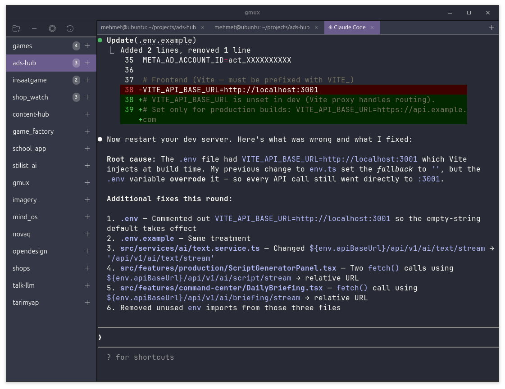

# gmux - GTK4 Terminal Multiplexer

A modern terminal multiplexer built with GTK4 and VTE, featuring vertical tabs and planned project management capabilities.



## Quick Start

```bash
# Build
make

# Run
./gmux
```

## What is gmux?

gmux provides a clean tabbed terminal interface with:
- **Vertical tabs sidebar** for easy terminal switching
- **Full-featured terminals** using VTE (same engine as GNOME Terminal)
- **Simple UI** with + and - buttons to manage terminals
- **Dynamic tab names** that update from terminal title

## Current Features

- Vertical tabs with terminal list
- Add/remove terminals
- Full VTE terminal emulation
- 10,000 lines scrollback
- Mouse support
- Dynamic tab titles
- Stable and crash-free

## Requirements

```bash
sudo apt install build-essential pkg-config
sudo apt install libgtk-4-dev libvte-2.91-gtk4-dev
```

## Building

```bash
make
```

The binary will be `gmux` (28KB).

## Usage

Simply run:
```bash
./gmux
```

- Click **+** button to add a new terminal
- Click **-** button to remove current terminal
- Click any tab in the sidebar to switch to it

## Future Plans

See [ROADMAP.md](ROADMAP.md) for detailed future plans, including:
- Horizontal tabs within terminals
- Theme support
- Project management
- Enhanced left panel with project list
- And much more!

## Technical Details

### Why VTE instead of Ghostty?

Initially tried to use libghostty (like cmux does on macOS), but:
- libghostty only supports macOS/iOS platforms
- No Linux/GTK support in the C API yet
- VTE is the standard Linux terminal widget (used by GNOME Terminal, Tilix, etc.)

See [ROADMAP.md](ROADMAP.md) for full development history.

### Project Structure

```
gmux/
├── src/
│   └── main.c          # Main application (306 lines)
├── Makefile            # Build configuration
├── README.md           # This file
└── ROADMAP.md          # Future plans and detailed docs
```

## License

AGPL-3.0-or-later

## Credits

- Inspired by [cmux](https://github.com/manaflow-ai/cmux)
- Built with GTK4 and VTE
- Originally attempted with [Ghostty](https://github.com/ghostty-org/ghostty)
